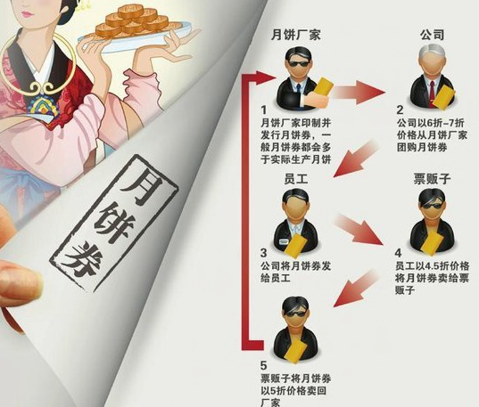

### 月饼券金融
中秋小长假刚开始，就在地铁口发现了好多“回收月饼券”的地摊。“该不会是有些月饼厂商只发行月饼券，而根本就不生产月饼，怕别人去兑换月饼，所以才以一定折扣回收的吧？难道，月饼券已经成为一种金融衍生品了吗？” 

其实，月饼券回收现象，早在四五年前就出现了。月饼券产业的链条大致是这样：某月饼厂商印了一张120元的月饼券，以90元卖给了经销商，经销商以100元一张卖给了消费者A,消费者A将月饼券送给了B,B以50元一张卖给了黄牛；然后，厂家再以60元一张的价格从黄牛手里回收。在这个链条中，没有生产月饼，但厂商赚了30元 ,经销商赚了10元，A送了人情 ,B赚了50元，黄牛赚了10元。厂家不需要生产月饼，只需要印制月饼券，就可以让这么多人同时赚钱，这就是“月饼证券化”!原来玩金融赚钱这么容易，怪不得大家都不愿意干“又脏又累”的制造业了。

厂家是精明的，他回收月饼券的价格肯定是低于月饼的生产成本，即他以60元的价格收回，则月饼的平均生产成本可能是70元或更高。因此，对厂家来说，卖月饼券，然后再回收，要比真正卖月饼给消费者更有利可图。所以说，在拿到月饼券的消费者中，真正吃月饼的人越少，厂家就越开心。事实上，厂商之所以敢放手印刷出超出自己生产能力的月饼券，就是赌定了大部分拿到月饼券的人根本就不会吃月饼。在这种逻辑下，厂商如果卖出去了1000张月饼券，可能实际上只需要生产200盒月饼，其余的800张都通过一系列虚拟交易进入了“回收链”,不需要跟实物挂钩。但实际需要生产的月饼数量究竟是不是200盒，却是需要琢磨一番的：假如厂商只生产了200盒，但拿着月饼券找他兑换的消费者有300人，那他就陷入了“兑付危机”;假如只有100人来兑换，那就有100盒月饼浪费了。

理论上讲，在发出去的这1000张月饼券中，如果有100张被消费者拿来兑换月饼，那就有900张进入了虚拟交易领域；然而，因为商家手上有200盒月饼，因此，他计划回收的月饼券，不会超过800张。这样，一方面商家手上有100盒月饼闲置，另一方面，消费者手上有100张月饼券闲置，造成了极大的浪费。当然，这只是一种交易的逻辑，真实情况，远比这复杂得多。实际上，即便是厂家不来回收月饼券，有的消费者也不会去兑换，他们宁可让这些月饼券闲置在手里也懒得去折腾。这种情况，无疑可以让厂家的利润最大化，然而，现在，厂家来回收，让这些人“白赚了一笔”,而对厂家来说，则是每张月饼券的利润减少了60元。

 