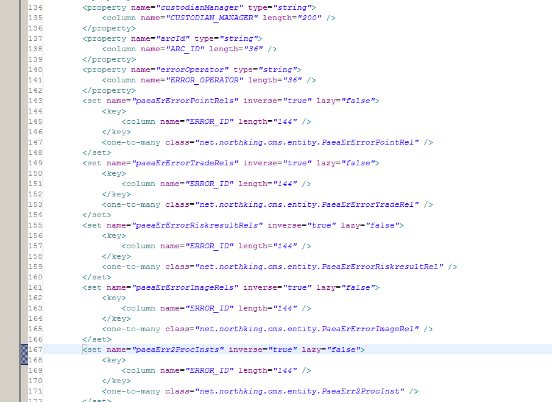
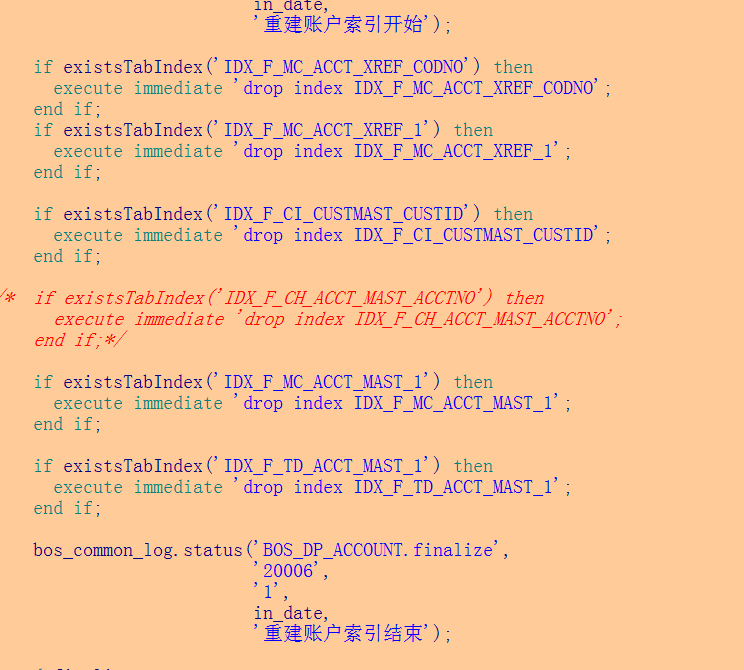
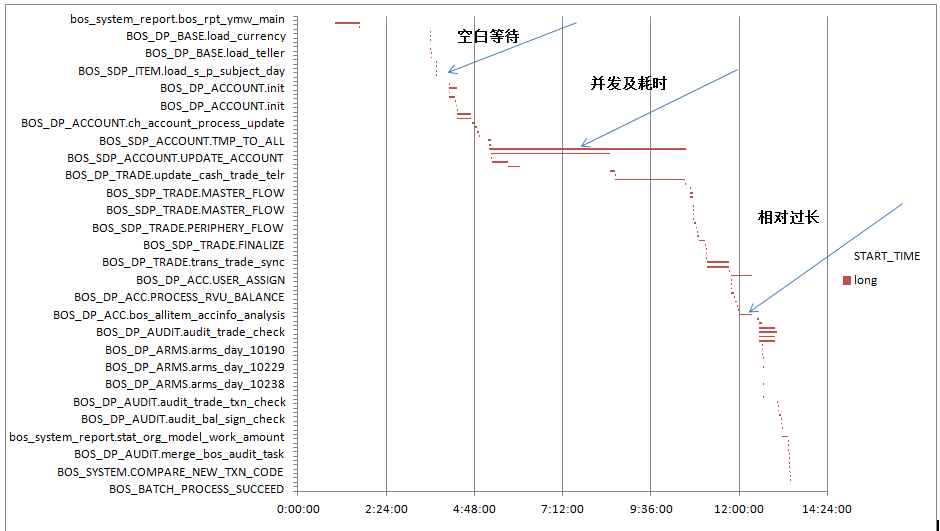
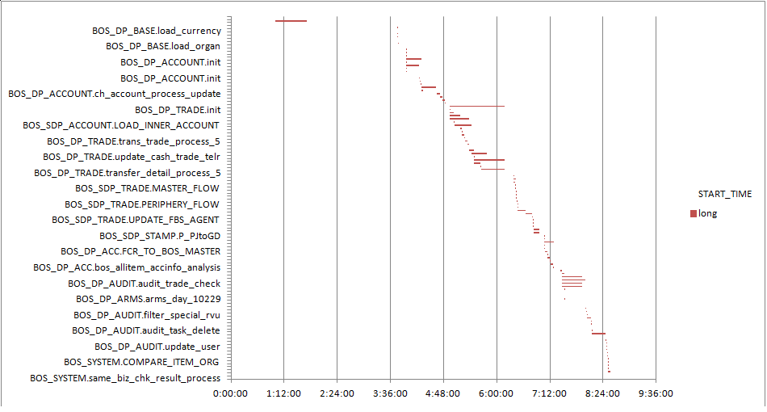

<!-- toc -->

# 性能优化 Oracle 开发整理

---
## 前言
  工作中，用Oracle来处理数据，因为有大量的数据加工逻辑，性能一直是个瓶颈，近1年半来，为了性能的提升基本上是重构了整个批量框架。下面是近期整理的一些TIPS，希望对后入坑者些启示。


---
## Oracle游标优化思路

  在应用上之所以使用Oracle的游标，很多时候是出于一笔笔记录循环来处理的思想进行设计的。
  但是使用Oracle游标的时候有个问题，就是这个一笔笔处理的循环的次数问题，假如总计有10w的数据量，单次的循环数据处理时间是0.1s，那总时长就是` ` 

  ````
  10W*0.1s=16.7min
  ```


  从上面的结构上看，提升整个性能无非从2个方面入手：


### 提升单次循环的处理效率
	
 单次循环的循环体中一般情况下都是放了很复杂的业务逻辑，维持代码逻辑可读性的基础上(不用超大SQL)，单词循环的效率很难有大的提升，除非你的单次循环耗时真的很长，达到几十秒甚至更久，可以考虑优化SQL。对于毫秒级别的单次循环已经很难有大的提升空间。


### 降低循环次数
  其实对这类的场景，降低循环的次数才是真正的解决方案，降低循环的次数开发过程中可以从如下的方案考虑：


#### 方案一  拆分数据
  拆分数据，好比说循环一张表的数据10W笔，正常情况下此类的循环并不会给数据库带来很大的压力，可以考虑拆分数据并发处理。比如，可以将这个10W的表拆分成5组，CALL PROCEDURE YourPro（ parallel_num ） 的时候将需要执行的组号放进来，然后再组织游标的时候根据组号来定位数据。

  这个方案要注意如下的点：
  - 拆分的粒度要根据实际的机器负载来看；
  - 不要一上来就平均分配，这样会引起全表扫描，尽量根据业务属性字段分组【如果这张表批量的时候，不涉及到dml操作，可以考虑用特殊业务字段做函数bitmap索引】
  - 因为拆分后同样的逻辑在并发的跑，所以可能出现对同一张目标业务表的dml操作，请确认好相互之间不会发生锁，因为Oracle是行级锁，粒度控制好应该问题不大，甚至你可以用临时目标表的方案，每个并发仅处理本并发的数据，回头再统一合并。
   
  **补：**
  但是这个方案，并没有根本解决循环的问题。循环慢的根本原因在PL\SQL 和 Oracle数据库完全是2个东西，PL\SQL只不过是标准SQL的拓展，用于更方便的实现业务的逻辑，Oracle把2个产品结合在了一起，让很多开发人员认为PL\SQL就是Oracle的唯一实现。其实Oracle最迅捷的实现还是最原始的标准SQL，任何的PL\SQL执行Oracle都是需要再到PL\SQL的解析引擎模块去做交互，你循环的次数越多，用到的PL\SQL特性越多，那它交换的次数就越多，时间耗的就更多。

  我们不反对用PL\SQL，但是在设计的时候尽量从SQL的特性去做设计，面向表和大批量数据的思想设计程序。很多Oracle的性能优化也都是针对单SQL的，而非针对整个PROCEDURE 的，所以能用单SQL处理的逻辑就不要用循环。


#### 方案二 改造程序
  如上所属，能一步到位的操作就不要用多步实现，将循环打掉。每个业务的业务逻辑不同如何拆分逻辑其实现均是不同的，但是实现的时候可以从如下几个点去考虑：
  - 确认需要处理的数据范围，在正式的进入业务逻辑之前，尽量的去筛选精简数据
  -  并不是只要用索引就可以提升性能的，有时候hash全表更快
  -  不要用子查询，即一个select 中有另外一个select 
  -  找到代码的可读性 和 单大SQL 处理的平衡
  -  不要使用大量的临时表，能一个SQL处理时间就一个SQL做


  **补：**
  	下面是日常整理的一些优化小结。


---
## 性能优化-分析篇
  以BOS系统为例，BOS系统每日需要处理的数据量极其巨大，但是Oracle仅是一个单机在跑。
  BOS的性能向来都是一个大问题，一直都是在业务不可忍受的边缘徘徊，因为种种的原因我们并没有太多的时间来做性能方面的优化调整，但是从以往的经验上来看，BOS的性能点可以从如下的几个方面分析：


### BOS的应用端的性能点
  - **场景1：使用Hibernate的代码**

  	使用Hibernate的代码程序经常有个比较坏的习惯，就是查询一次JAVA Bean对象封装了多次的级联查询，往往把不需要的数据都级联查询出来，导致整个交易的场景性能极其低下，且耗费大量的内存。
  	比较容易出现问题的场景是 **人工勾对**和**差错相关**。
  	> 此类的场景的解决方案就是按照需要查询，如果担心变更会影响到其他不常用功能的话，那直接改为Ibatis的方式处理。

  


  ---	

  - **场景2：应用端的开发人员，对数据性能优化意识不高**

  	特别是一些新的开发同事，在做一个新的功能时候，考虑的仅仅只是实现这个功能，因为开发和测试环境的数据量同生产有很大的差异，并不能测试的出来。但是一旦投产以后性能问题就会显现出来。**所以开发任何程序的时候都必须思考功能需要涉及表的数据量有多大，需要如何进行性能优化。**

   > 此类场景需要老员工认真复核逻辑，并提醒测试方，关注数据量问题。

  ---

  - **场景3：因为后台的程序在做批量导致性能低下**

    此类的场景一般是后台在做批量，但是前端又使用到了这个表，经常出现问题的场景一般是对账户表的处理，PAEA_DS_ACCOUNT ，因为账户表每次批量都是要重构，每次都要重建索引，在重建索引的时候业务要查询这张表。
  > 此类的场景需要大的改造方案才能处理，尽量的将全量的处理调整为增量的处理，或者是用Rename交换的方式交换（这样可能存在交换失败的风险，要统筹考量）

  

  ---

  -  **场景4：内存溢出或者卡死**
  此类的一般都是前端某个功能查询不到数据，数据库有打开的进程卡死导致，定位到需要优化的SQL以后，让运营重启应用，Kill掉卡死的进程就好了。

   > 如果是内存溢出，需要让运营将Dump导出，让后我们来分析。

  - **场景5：平常没什么问题，突然有一天就卡了**
  此类的问题经常出现在上游大的版本之后，数据量变化巨大，或者是在月末年末等比较特别的时间点，因为这些时间点的数据量变化比较巨大，导致SQL的执行计划出现变更，然后就慢了。


---
### BOS的后台Oracle的性能优化
  BOS系统大头性能问题是在后台，后台优化是我们一直在做的事情，我们在16年初的时候将大部分的数据加工放到了GP上，但是即使这样依然有些性能问题。
  下面是之前BOS项目的一次典型的性能优化，从这个性能优化中可以学习到很多的东西。


#### 1. 前言
  本次性能优化解决的主要问题是后督长时间批量问题，后面将按照我们的分析过程分享下我们的解决思路。


#### 2. 定位问题
  因为我们的优化是系统级别的优化，所以定位整个批量的关键耗时很重要，另一方面我们想知道我们每个时刻大概有多少的批量线程在执行。我们在系统关键的存储过程细化了日志，然后利用这些日志做了批量时序图。
  根据批量是时序图可以得到以下信息：
  （1）	可以比较直观的得到整个系统长时间耗时的存储过程在哪个时间段；
  （2）	可以比较直观的得到系统的并行处理情况；
  （3）	可以比较直观的分析出，存储过程在调度之前的等待时间；
  （4）	利用时序图你可以同生产的主机运行图做比较，概略的知道每个时间点主机的IO\CPU等是一个什么样的状态。

  使用时序图的另外一个好处就是，可以将那些串行但耗时不多不少的SQL优化下，优化个4~5个那你的整体批量就有可能缩短1个小时。系统级别的性能优化不仅仅是TOP SQL的优化。


  


#### 3. 分析问题


##### 3.1	业务面
  （1）**反思业务必要性**
  作为银行的系统，系统的业务相关性较强，所以优化的第一步需要考虑的并不是如何技术解决TOP SQL，而是反思我们所加工的业务数据它真正用途是什么，业务是否真正需要，如果业务需要的话，那业务需要的是全部数据，还是仅仅一部分。

  针对业务的必要性，我们梳理了系统中所有用到的点，然后再同业务商讨其必要性，对后督来讲我们梳理出如下结论：
  后督目前为止用到的账户数据的用途：
  >  1、需要每日全量的内部账科目余额信息,用于账务核对；
  >  2、客户账目前仅关心其户名用于同凭证核对，其他暂不关心
  		
  明确了业务的明细需求，我们调整了账户加工逻辑，定期原来从30min变成了2min，后期我们将实现FCR全量接口改增量接口，到时候我们每天需要处理的接口文件可以下降10Gb，整个账户加工从原来的60min优化到10min之内（含文件加载清洗）。

  ---

  （2）**反思逻辑必要性**
  咱们有很多都是5年以上甚至更久的系统，中间经手改造了N次，有很多的逻辑早已经不再适应现在的业务规则，但是因为我们自己对系统的不了解，不确定，有的时候就睁一只眼闭一只眼过去了，时间一累计，问题就出来。

  针对逻辑必要性，后督是规则类系统，我们重新梳理了我们不确定的Old逻辑，同源头沟通具体的业务逻辑含义，再通过现在的逻辑去生产反向验证，现在的逻辑到底是否起作用。

  > 根据我们的沟通梳理，支付系统的流水加工逻辑可以取消了。而取消的这部分逻辑正是我们经常生产hang死的逻辑，并且整个接口文件可以下降7Gb的大小。


---
##### 3.2	技术面
  SQL分析，一般情况下分两个方面，整段存储过程的执行逻辑分析，单个SQL效率的分析。


##### 3.2.1	一条语句搞定的事情就不要分的太多**
  **案例1：**
  后督的存储过程是使用PL/SQL写的，而对PL/SQL语句的执行对Oracle数据库来讲，就可能需在PLSQL解析器和Oracle执行引擎之间来回的切换，假如是一段一段的执行还好，但是如果是在类似for循环中不断的切换，那就会十分的耗时了，如下面的SQL：

  ```sql
  for cc_c in (select sys_txn_seq,ref_sub_seq_no, ctr_batch_no, pay_acc_no,
                         …………
                          to_brcode
                     from paea_ds_trade_temp) loop

   if cc_c.pay_acc_no is not null and cc_c.to_brcode is not null then
          update paea_ds_trade_temp tp
             set tp.pay_acc_no    = cc_c.pay_acc_no,
  		……
           where sys_txn_seq = cc_c.sys_txn_seq
             and ctr_batch_no = cc_c.ctr_batch_no
             and ref_sys_tr_aud_no = cc_c.ref_sys_tr_aud_no;
          commit;
  end if;
   if cc_c.pay_acc_no is not null and cc_c.to_brcode is not null then
          update paea_ds_trade_temp tp
             set tp.pay_acc_no    = cc_c.pay_acc_no,
         	……
           where sys_txn_seq = cc_c.sys_txn_seq
         ………
          commit;
  End if;
  ………
  End loop;

  ```


  **For循环了800多万次，生产的执行时间50min~80min。（具体为什么不稳定可能是CPU征用问题）**

  我们的优化方案是：
  > 将需要更新的字段放在游标中计算好，然后直接一次性更新。

  虽然耗费了排序的时间，但是是值得的，**最后800w的数据更新，稳定在14分钟内就执行完成了。**

  ```sql
  SELECT rowid row_id,
         FIRST_VALUE(p.pay_acc_no) OVER(PARTITION BY sys_txn_seq, ctr_batch_no, ref_sys_tr_aud_no ORDER BY p.pay_acc_no ASC RANGE BETWEEN UNBOUNDED PRECEDING AND UNBOUNDED FOLLOWING) pay_acc_no,
         FIRST_VALUE(p.pay_cust_name) OVER(PARTITION BY sys_txn_seq, ctr_batch_no, ref_sys_tr_aud_no ORDER BY p.pay_cust_name ASC RANGE BETWEEN UNBOUNDED PRECEDING AND UNBOUNDED FOLLOWING) pay_cust_name,
         FIRST_VALUE(p.to_acc_no) OVER(PARTITION BY sys_txn_seq, ctr_batch_no, ref_sys_tr_aud_no ORDER BY p.to_acc_no ASC RANGE BETWEEN UNBOUNDED PRECEDING AND UNBOUNDED FOLLOWING) to_acc_no,
         FIRST_VALUE(p.to_cust_name) OVER(PARTITION BY sys_txn_seq, ctr_batch_no, ref_sys_tr_aud_no ORDER BY p.to_cust_name ASC RANGE BETWEEN UNBOUNDED PRECEDING AND UNBOUNDED FOLLOWING) to_cust_name,
         FIRST_VALUE(p.to_brcode) OVER(PARTITION BY sys_txn_seq, ctr_batch_no, ref_sys_tr_aud_no ORDER BY p.to_brcode ASC RANGE BETWEEN UNBOUNDED PRECEDING AND UNBOUNDED FOLLOWING) to_brcode  FROM paea_ds_trade_temp  p order by row_id;
  ```

  ---


  **案例2：**
	这个案例是关于批量一次性插入的问题，空间换时间，我们推荐最好同DBA商定后再做。

  > 原则很简单我们将原来的800w的流水循环每100笔提交一次调整为直接一次性insert。从原来的35min缩短为14min。

  PS：后督的**undo空间**是很大的，没问题。但其他系统需要评估，所以请先评估你们的表空间。


---
##### 3.2.2	单个SQL优化
  （1）尽量不要使用嵌套子查询
  （2）走索引并不是一定会快
  （3）合理使用bitmap和row_id
  （4）大批量插入比大批量更新更快；

  下面将逐个说明

  ----
  ####   **子循环&Hash**

   **案例：**
  	使用嵌套子查询在数据量少的时候可能感觉不出来，但是一旦数据量多了，其性能效率是十分低的，因为每一笔数据都有可能需要走一次子查询。

  下面是后督流水加工的语句，使用了大量的子查询：

  ```sql
       select   decode(t1.REF_USR_NO,null,t2.ref_usr_no,t1.REF_USR_NO),         --业务流水号

                t1.REF_TXN_NO,                                                  --系统流水号
                t1.COD_GL_ACCT,                                                 --科目
                decode(t1.COD_DRCR,'C',1,0),                                    --借贷方向
               (select t4.cod_user_id_ext from F_SM_USER_PROFILE t4 where t4.cod_user_id = t1.cod_user_id AND rownum =1 ),                                        --柜员UM号
               t1.dat_txn_posting,                                                -- 核心记账日期
               substr(to_char(t2.DATE_SYS,'yyyyMMdd hh24:mi:ss'),10,9),         --流水发生交易时间
               t2.DAT_VALUE,                                                    --生效日期
               (select t3.NAM_CCY_SHORT from f_ba_ccy_code t3 where t3.cod_ccy=t1.COD_GL_ACCT_CCY) CCY_CODE, --币种
               t1.AMT_TXN_FCY,                                                  --金额
               t2.COD_BRN,                                                      --交易发生网点号
              (select nvl(DECODE(lg.typ_acct,
                              'SC',
                              DECODE(t1.COD_DRCR,
                                     'D',
                                     lg.cod_sub_acct_no,
                                     lg.OTH_ACCT_NO),
                              lg.cod_sub_acct_no),
                       case
                         when substr(COD_GL_ACCT, 1, 4) in ('2011', '2012', '2013') then
                          t1.cod_acct_no
                         else
                          null
                       end) COD_ACCT_NO
              from f_xface_addl_details_txnlog lg
             where t1.ref_txn_no = lg.ref_txn_no
               and TRIM(to_char(t1.ctr_batch_no)) || '~' ||
                   TRIM(to_char(t1.ref_sys_tr_aud_no)) || '~' ||
                   TRIM(to_char(t1.ref_sub_seq_no)) = lg.ref_key_no(+)
               and rownum = 1) COD_ACCT_NO,                                  --账号
               to_char(t1.cod_cc_brn),                                          --核算网点
               (select lg.cod_acct_no
                from  f_xface_addl_details_txnlog lg
                where t1.ref_txn_no = lg.ref_txn_no
                and TRIM(to_char(t1.ctr_batch_no)) || '~' ||
                          TRIM(to_char(t1.ref_sys_tr_aud_no)) || '~' ||
                          TRIM(to_char(t1.ref_sub_seq_no)) = lg.ref_key_no(+)
                and   lg.typ_acct_no='CARD'
                and   rownum = 1) card_no,                                      --交易卡号
                decode((select count(1) from dual
                        where length(trim(t1.ref_txn_no_org))>0
                        and   t1.ref_txn_no_org<>t1.ref_txn_no),0,'0','1'),     --冲销标识,0正常，1冲销
                t1.ref_txn_no_org,                                              --冲销流水号
                decode((select count(1) from F_SM_USER_PROFILE t5
                        where t5.cod_user_id = t1.cod_user_id
                        and   t5.cod_branch_templ=100
  and rownum =1 ),0,'3','1'),                   --非实体柜员过滤判断
                t1.CTR_BATCH_NO,                                                --批号
                t1.REF_SYS_TR_AUD_NO,                                           --系统审计跟踪号
                t1.REF_SUB_SEQ_NO                                               --交易子序号
        from  F_XF_STCAP_GL_TXNS_MMDD t1,F_REC_TXN_LOG_MMDD t2
        where t1.dat_txn_posting = in_date
        and   t1.dat_txn_posting = t2.dat_post
        and   t1.ref_txn_no = t2.ref_txn_no
        and t1.COD_GL_ACCT not in (499901031,499901032,499901033,499901034,499901035);

  ```

  **方案：**
  （1）	将所有套用的子查询中用到的表，全部提取出来和主表做关联，再通过强制指定use_hash的hint，可以将原本通过nestloop进行连接的查询变成hashjoin，提高几个大表之间进行关联的效率。

  （2） 特别是针对F_SM_USER_PROFILE这个表，需要在关联之前先通过分析函数处理一下，以保证通过这个表取值的两个字段都能取到唯一且正确的数值。此外，原本的查询中冲销标识是通过查询dual虚拟表来判断取值的，这里也可以直接通过case when来判断，从而简化原本逻辑。
  其中:
  F_XF_STCAP_GL_TXNS_MMDD t1,F_REC_TXN_LOG_MMDD t2 是FCR的流水表数据量在800w。

  需要特别指出的是，**这里面使用了强制hash索引的hint**。我们之前为了做两张表的关联也都各自做了相应的索引，但是我们测试的时候发现当这个语句走索引的时候会导致大量的I/O等待。其实想想也明白，当你仅找单笔或几笔数据的时候，查询是先搜索引再取数据，效率很快。但是当你查询大量的数据的时候，老是走索引再取数，索引也是文件，那就会很消耗I/O。这样还不如使用hash的方法做全表的hash关联快。

  至于为什么hash会快，可以了解下hash算法及Oracle的hash关联。


  > 优化了以后从原来的200多min，减少到了17min。

  **优化后脚本**

  ```sql
       select   /*+ use_hash(t2, t1, lg) */
                decode(t1.REF_USR_NO,null,t2.ref_usr_no,t1.REF_USR_NO),         --业务流水号
                t1.REF_TXN_NO,                                                  --系统流水号
                t1.COD_GL_ACCT,                                                 --科目
                decode(t1.COD_DRCR,'C',1,0),                                    --借贷方向
                t4.cod_user_id_ext,                                               --柜员UM号
               t1.dat_txn_posting,                                                -- 核心记账日期
               to_char(t2.DATE_SYS,'hh24:mi:ss'),                               --流水发生交易时间
               t2.DAT_VALUE,                                                    --生效日期
               t3.NAM_CCY_SHORT,                                                --币种
               t1.AMT_TXN_FCY,                                                  --金额
               t2.COD_BRN,                                                      --交易发生网点号
               nvl(DECODE(lg.typ_acct,
                              'SC',
                              DECODE(t1.COD_DRCR,
                                     'D',
                                     lg.cod_sub_acct_no,
                                     lg.OTH_ACCT_NO),
                              lg.cod_sub_acct_no),
                       case
                         when substr(COD_GL_ACCT, 1, 4) in ('2011', '2012', '2013') then
                          t1.cod_acct_no
                         else
                          null
                       end) COD_ACCT_NO,                                     --账号‘2011、2012、2013开头的是科目产品类’  
               to_char(t1.cod_cc_brn),                                          --核算网点
  /*           (select lg.cod_acct_no
                from  f_xface_addl_details_txnlog lg
                where t1.ref_txn_no = lg.ref_txn_no
                and TRIM(to_char(t1.ctr_batch_no)) || '~' ||
                          TRIM(to_char(t1.ref_sys_tr_aud_no)) || '~' ||
                          TRIM(to_char(t1.ref_sub_seq_no)) = lg.ref_key_no(+)
                and   lg.typ_acct_no='CARD'
                and   rownum = 1) card_no,                                      --交易卡号*/
                decode(lg.typ_acct_no, 'CARD', lg.cod_acct_no, null) card_no,   --交易卡号
                case when length(trim(t1.ref_txn_no_org)) > 0 and
                    t1.ref_txn_no_org <> t1.ref_txn_no then '1'  else  '0' end, --冲销标识,0正常，1冲销
                t1.ref_txn_no_org,                                              --冲销流水号
                case when t4.temp1=1 and t4.cn >0 then '1' else '3' end,        --非实体柜员过滤判断
                t1.CTR_BATCH_NO,                                                --批号
                t1.REF_SYS_TR_AUD_NO,                                           --系统审计跟踪号
                t1.REF_SUB_SEQ_NO                                               --交易子序号
        from (select t.* from F_XF_STCAP_GL_TXNS_MMDD t
               where t.cod_gl_acct not in (499901031,499901032,499901033,499901034,499901035)
                 and t.dat_txn_posting = in_date) t1
              join  F_REC_TXN_LOG_MMDD t2 
                on (t1.ref_txn_no = t2.ref_txn_no and t1.dat_txn_posting = t2.dat_post)
              left join f_xface_addl_details_txnlog lg
                     on (t1.ref_txn_no = lg.ref_txn_no and t1.ref_key_no = lg.ref_key_no)
             left join f_ba_ccy_code t3
             on (t3.cod_ccy=t1.COD_GL_ACCT_CCY)
             left join (select *
                          from (select cod_user_id,
                                       cod_user_id_ext,
                                       decode(cod_branch_templ, 100, 1, 2) temp1,
                                       row_number() over(partition by cod_user_id order by cod_user_id, decode(cod_branch_templ, 100, 1, 2)) cn
                                  from F_SM_USER_PROFILE)
                        where cn = 1) t4
             on (t4.cod_user_id = t1.cod_user_id);

  ```


---
#### 合理使用bitmap和row_id
  **案例2：**
  Bitmap的合理使用。**Bitmap当有并发的时候会很麻烦，但是在单例批量，数据重复性很高的时候bitmap就是很好。**

  > 如：我们原先需要在500W的数据中找余额不为0的数据，需要20min左右去全表扫，但是我们分析下了数据，发现这500w的内部账数据理论上都应该是0的，所以我们加了个bitmap，整个耗时变成了1 min。

  ```sql
      execute immediate 'CREATE BITMAP  INDEX INX_BAL ON  PAEA_DS_INNER_ACCOUNT(BAL)';
      insert /*+append */ into bos_allitem_accinfo
        (id, itmno, vch_ac, ccy_code, br, bal, in_date)
      select id, itmno, vch_ac, ccy_code, br, bal, in_date
        from paea_ds_inner_account
       where bal <> 0;
  ```

  ---
  **案例3**
  	我们有个更新流水户名的操作，耗时40min以上，[paea_ds_trade_temp]800w,  PAEA_DS_ACCOUNT 3000w

  ```sql
  update (select \*+BYPASS_UJVC*\
                    pt.cust_name cust_name, lg.vch_name vch_name
                     from paea_ds_trade_temp pt, PAEA_DS_ACCOUNT lg
                    where pt.acc_no = lg.vch_ac) m
             set m.cust_name = m.vch_name;

  ```

  分析了下执行计划，即使给流水表账户加上索引。最后还是会全表一条一条的去到账户表找户名，效率很低。
  随后我们又分析了下数据，发现800w的流水中，disticnt的帐号才70w左右。随后调整为如下的脚本：

  ```sql
  execute immediate 'create bitmap index PAEA_DS_TRADE_TEMP_ACCNO  on PAEA_DS_TRADE_TEMP(ACC_NO) tablespace BOSIDX';
  CURSOR CUR_CUNAME IS
          select row_id, vch_name
            from (select pt.rowid row_id,
                         lg.vch_name
                    from paea_ds_trade_temp pt, PAEA_DS_ACCOUNT lg
                   where pt.acc_no = lg.vch_ac
                     and lg.vch_name is not null)
           order by row_id;
  OPEN CUR_CUNAME;
             LOOP
               FETCH CUR_CUNAME BULK COLLECT
                 INTO V_row_id, V_vch_name LIMIT 10000;
               EXIT WHEN V_row_id.COUNT = 0;
               --批量写入业务数据
               FORALL I IN 1 .. V_row_id.COUNT
                 update paea_ds_trade_temp tp
                    set tp.cust_name = V_vch_name(I)
                  where rowid = V_row_id(I);
               commit;
             end loop;
             CLOSE CUR_CUNAME;

  ```

  > 先做bitmap，根据bitmap去关联账户表缩小查询范围，然后在利用row_id直接更新减少二次查询。性能从原来的40min，稳定为14min。


---
#### 大批量插入比大批量更新更快；
  后督的做对手信息加工的时候需要对原先800w的流水数据重新更新，导致耗时50min以上，后调整为先关联查询insert到同构表，后rename回来，耗时变为17min。

  > 另外对大批量的数据处理，如果业务层（如根据日期、系统来源、业务属性字段等）可以分开的话可以利用分区置换等方式节约数据同步或数据清理成本。

  后续后督会做大表归档，及增全量账户数据同时加工到一个业务表、各渠道账务流水接入加工等会继续优化使用这些方案。


---
### 优化效果

  **优化前**

  

  **优化后**

  

  ---


---
## 性能优化-操作篇
  **用户**
  需要DBA授权一些用户，做一些视图的查阅。


### 操作步骤


#### STP1：获取Session信息

  ```sql
  ------获取当期plsql窗口的sid，使用匿名块测试存储过程会用到；
  select userenv('sid') from dual;
  ------获取当前的session信息；
  select * from v$session where sid = '1618';
  ```


#### STP2：获取SQL执行信息

  ```sql
  -------此表基本上是每隔1s收集一次当前session的sql在干嘛，可以了解下等待事件等信息，这个是实时收集的。
  select *
    from v$active_session_history g
   where g.session_id = '1618'
     and g.SESSION_SERIAL# = '16952'
   order by 1 desc;
  ```


#### STP3: 定位高耗时

  ```sql
  -----根据这个语句可以粗略统计出来，某段时间内到底是哪些SQL的耗时比较高。然后在据此查询其执行计划。用于批量已经结束了但是需要确认下当时的执行状态。
  select a.*,b.*
  from (select count(1)num ,sql_id
    from v$active_session_history h
   where h.SAMPLE_TIME >= to_date('20140826 22:57:49', 'yyyymmdd hh24:mi:ss')
     and h.SAMPLE_TIME <= to_date('20140827 0:41:21', 'yyyymmdd hh24:mi:ss')
   group by sql_id)a
   left join dba_hist_sqltext b on  a.sql_id=b.sql_id
  order by num desc
  ```


#### STP4: 获取当前内存执行计划

  ```sql
  ---获取当前正在执行SQL的执行计划，这个是实时的。
  select * from table(dbms_xplan.display_cursor('#sql_id#','#sql_child_number#','#ALL#'))
  ```


#### STP5: 获取历史执行计划

```
---获取历史SQL的执行计划，如果这个sql执行过了可以通过这个来查看当时的执行计划；
select *  from table(dbms_xplan.display_awr('7yx3q2hg2xrs7'));

```


---
### 小结
  Oracle是对数据的加工，其底层提供了通过不同算法实现的各种各样接口，而执行计划其实就是Oracle自己根据你的数据结构及索引信息计算出来的一套取数的方案，而这套方案最关键的就是各个接口的选取以及其执行顺。

  所以了解执行计划首先需要了解的就是各个接口代表的含有及其他们关联方案的含义，这个大家可以抽空了解下。

  另外就是，在Oracle做执行计划计算的时候，需要依据一些统计信息（如你的表数据量等等），对于新的表或新的环境有的时候就没有这个统计信息，导致执行计划可能就不是你设想的那样了。这个时候最好找dba做个统计信息收集或者加个hint什么的。

  ``` sql
  	BEGIN
  	DBMS_STATS.GATHER_TABLE_STATS(
  	OWNNAME => 'test',
  	TABNAME=> 'test_table',
  	DEGREE=> DBMS_STATS.AUTO_DEGREE,
  	CASCADE=> TRUE);
  	END;
  ```

  最后，做性能优化比较耗时，而且永无止境，越看越想改，需要注意下产出比。


---
### 推荐阅读
  **推荐《Oracle高性能sql引擎剖析》前4章。**
  **推荐《Oracle 9i/10g/11g 编程艺术》**


---
## 使用其他分布式数据库
  Oracle 终究不是大数据分析的数据库，当数据量增长到一定的程度的时候，还是请考虑 使用其他的分布式加工程序，PostgreSql 和 Hadoop 都是很好的选择，仅对BOS系统而言，我们将大批量的数据清洗工作放在了PostgreSql 上做，利用Oracle实现将复杂的业务逻辑。

  PostgreSql  将原本需要8个小时的批量，搞到了30min以内。
